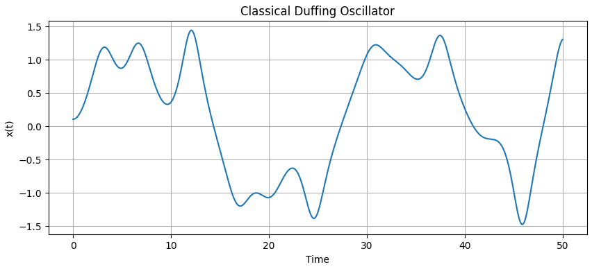
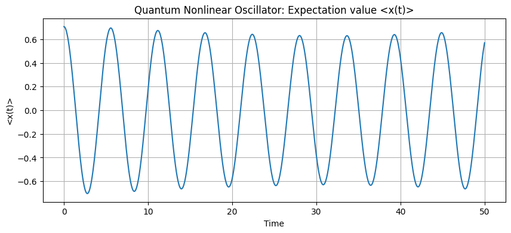
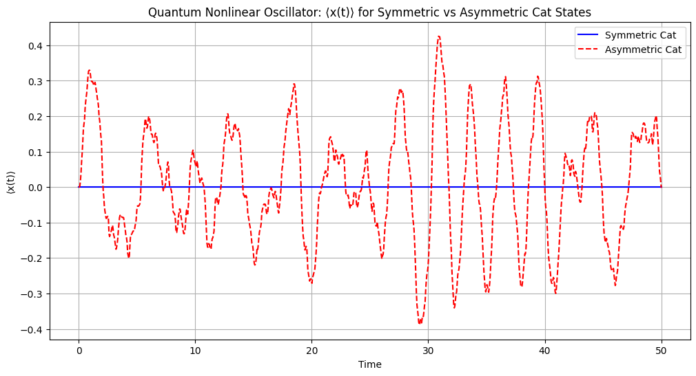
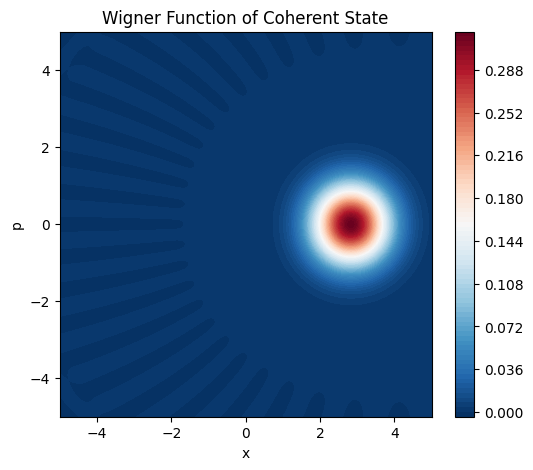
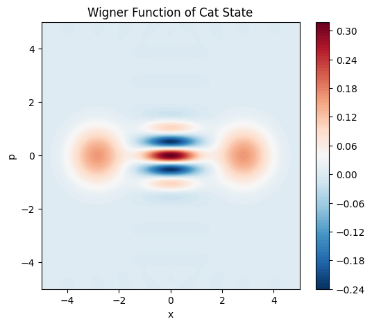

# Quantum Computation and Nonlinear Oscillators

This repository contains code and results for simulating the classical and quantum dynamics of nonlinear oscillators, specifically the Duffing oscillator model. The project explores the behavior of quantum states—such as coherent and Schrödinger cat states—under a nonlinear Hamiltonian, visualized using tools like Wigner functions.

View the full report [here](https://github.com/NilayShenai/Quantum-Computation-and-Nonlinear-Oscillators/blob/main/paper.pdf)

## Overview

The simulation and analysis in this project cover:

- Classical dynamics of the Duffing oscillator using numerical solvers
- Quantum evolution using the QuTiP library
- Investigation of coherent and Schrödinger cat states
- Visualization with Wigner functions in phase space

## Key Features

- Classical Duffing oscillator simulation using `scipy.integrate.odeint`
- Quantum simulations with `qutip.mesolve`
- Expectation values: ⟨x(t)⟩ and ⟨p(t)⟩
- Wigner function rendering with `qutip.wigner`

## Files Included

- `osc.ipynb`: Jupyter notebook containing all code and plots
- `tex/`: Directory containing main.tex and key result visualizations
- `paper.pdf`: IEEE-style report summarizing the work
- `README.md`: This file

## Images

### Classical Duffing Oscillator



### Quantum Coherent State Evolution



### Quantum Cat State Evolution



### Wigner Function of Coherent State



### Wigner Function of Cat State



## Requirements

- Python 3.8+
- QuTiP
- NumPy
- SciPy
- Matplotlib

Install dependencies with:

```bash
pip install -r requirements.txt
```


